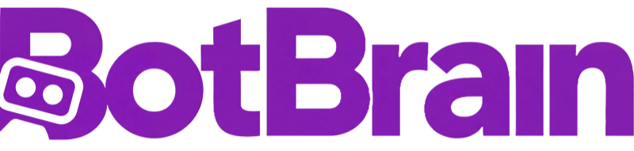
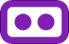
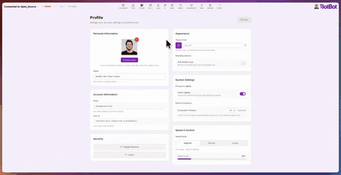

<!-- LOGO -->
<p align="center">
  <a href="https://botbot.bot" target="_blank">
    
  </a>
</p>

<p align="center">
  One Brain, any Bot.
</p>

<p align="center">
  
  
  
  
</p>

<p align="center">
  <a href="https://botbot.bot"></a>
  <a href="https://discord.gg/CrTbJzxXes"></a>
  <a href="https://www.linkedin.com/company/botbotrobotics"></a>
  <a href="https://www.youtube.com/@botbotrobotics"></a>
</p>

<p align="center">
  <a href="README.md"></a>
  <a href="docs/i18n/README_pt.md"></a>
  <a href="docs/i18n/README_fr.md"></a>
  <a href="docs/i18n/README_zh-CN.md"></a>
  <a href="docs/i18n/README_es.md"></a>
</p>

# BotBrain Open Source (BBOSS) 

BotBrain is a modular collection of open source software and hardware components that lets you drive, see, map, navigate (manually or autonomously), monitor, and manage legged (quadrupeds, bipeds and humanoids) or wheeled ROS2 robots from a simple but powerful web UI. The hardware gives you 3D printable mounts and an outer case so you can put BotBrain on your robot without guesswork.

- Designed around Intel RealSense D435i and the NVIDIA Jetson line
- Officially supported boards: Jetson Nano, Jetson Orin Nano (support for AGX and Thor coming soon)
- Everything is modular - you don't need to run every module (some heavy AI modules require Orin AGX)

<p align="center">
  <a href="https://youtu.be/L7nLiKkLVP4">📹 Watch BotBrain intro video 📹</a>
</p>

<p align="center">
  <a href="https://youtu.be/VBv4Y7lat8Y">📹 Watch BotBrain complete 1 hour of autonomous patrols in our office</a>
</p>


<h2 align="center">✨ Features at a Glance</h2>

<table>
  <tr>
    <td align="center" width="50%">
      <br>
      <h3>Dashboard & Fleet Control</h3>
      <p>Complete dashboard to see status, robot info and quickly jump to other sections</p>
    </td>
    <td align="center" width="50%">
      <br>
      <h3>CockPit</h3>
      <p>Predefined control page with full front/back camera, 3D model, map and navigation as well as quick controls</p>
    </td>
  </tr>
  <tr>
    <td align="center" width="50%">
      <br>
      <h3>My UI</h3>
      <p>Customizable control interface with all the features of cockpit</p>
    </td>
    <td align="center" width="50%">
      <br>
      <h3>Missions</h3>
      <p>Create missions for the robot to execute and navigate autonomously</p>
    </td>
  </tr>
  <tr>
    <td align="center" width="50%">
      <br>
      <h3>Health</h3>
      <p>View BotBrain's complete health: CPU/GPU/RAM usage, state machine nodes control and status, wifi connection control</p>
    </td>
    <td align="center" width="50%">
      <br>
      <h3>User Profile</h3>
      <p>Customize the look and feel of BotBrain, set custom colors, and speed profiles</p>
    </td>
  </tr>
</table>

<p align="center">
  <br>
  <h3 align="center">Open Source Hardware</h3>
  <p>Quick to 3D print, easy to build, and designed to snap onto any robot.
  Get your robot running with BotBrain in less than 30 minutes.</p>
</p>

<p align="center">
  <a href="https://youtu.be/xZ5c619bTEQ">📹 Watch BotBrain hardware assembly guide</a>
</p>


## Compleate features list

### Multi-Robot Platform Support
- **Unitree Go2 & Go2-W** - Quadruped robots with full hardware interface and control
- **Unitree G1** - Humanoid with upper-body pose control and FSM transitions
- **DirectDrive Tita** - Biped with full control
- **Custom robots** - Extensible framework for adding any ROS2-compatible platform
- **Legged & wheeled** - Architecture supports both locomotion types

### Hardware & Sensors
- **3D printable enclosure** - Snap-fit design with robot-specific mounting adapters (Go2, G1, and Direct drive Tita)
- **Intel RealSense D435i** - Dual camera support for viewing and SLAM/Navigation
- **IMU & odometry** - Real-time pose estimation from all supported platforms
- **Battery monitoring** - Per-robot battery state with runtime estimation

### AI & Perception (Coming Soon)
- **YOLOv8/v11 object detection** - 80+ classes, TensorRT-optimized, real-time tracking on BotBrain (Coming Soon)
- **ROSA natural language control** - Conversational robot commands via LLM
- **Detection history** - Searchable log with image and information / description (Coming Soon)

### Autonomous Navigation
- **RTABMap SLAM** - Visual mapping with single or dual RealSense D435i cameras
- **Nav2 integration** - Path planning, dynamic obstacle avoidance, recovery behaviors
- **Mission planning** - Create and execute multi-waypoint autonomous patrols
- **Click-to-navigate** - Set goals directly on the map interface
- **Map management** - Save, load, switch, and set home positions

### System Orchestration
- **Lifecycle management** - Coordinated node startup/shutdown with dependency ordering
- **State machine** - system states with automatic on/off
- **Priority-based velocity control** - 6-level command arbitration (joystick > nav > AI)
- **Dead-man switch** - Hardware/software safety lock for all motion commands
- **Emergency stop** - Comprehensive e-stop sequence

### Control Interfaces
- **CockPit** - Pre-configured control page with cameras, 3D model, map, and quick actions
- **My UI** - Drag-and-drop customizable dashboard with resizable widgets
- **Virtual joysticks** - Touch/mouse dual-stick control with velocity tuning
- **Gamepad support** - PS5, Xbox or generic joystick with custom button mapping and mode switching
- **Keyboard control** - WASD controls
- **Speed profiles** - Multiple velocity presets for different operational modes (Beginner, Normal and Insane mode)
- **Robot actions** - Stand/sit, lock/unlock, gait selection, lights, mode transitions

### Camera & Video
- **Multi-camera streaming** - Dynamic discovery for front, rear, and custom topics
- **H.264/H.265 codecs** - Resolution scaling, frame rate control, bandwidth optimization
- **In-browser recording** - Record video from cameras and save them to your downloads folder
- **3D visualization** - URDF-based robot model with laser scan overlay and navigation path

### System Monitoring
- **Jetson stats** - Board model, JetPack version, power mode, uptime
- **CPU/GPU monitoring** - Per-core usage, frequency, memory, thermal throttling
- **Power tracking** - Per-rail voltage, current, and wattage with peak detection
- **Thermals & fans** - CPU/GPU/SOC temps with fan speed control
- **Storage & memory** - Disk usage alerts, RAM/swap monitoring

### Networking & Fleet
- **WiFi control panel** - Network scanning, switching, and signal monitoring
- **Connection modes** - WiFi, Ethernet, 4G, hotspot with latency tracking
- **Multi-robot fleet** - Simultaneous connections, fleet-wide commands, status dashboard
- **Diagnostics** - Node health, error/warning logs, state machine visualization

### Customization & UX
- **Light/dark themes** - Custom accent colors, persistent preferences
- **Responsive layouts** - Mobile, tablet, and desktop with touch support
- **User profiles** - Avatar, display name, theme color via Supabase Auth
- **Multi-language** - English and Portuguese with regional formats
- **Audit logging** - Searchable event history across 10+ categories with CSV export
- **Activity analytics** - Usage heatmaps and robot utilization tracking

## Table of Contents

- [Overview](#overview)
- [Project Structure](#project-structure)
- [Requirements](#requirements)
- [Installation](#installation)
  - [Hardware Setup](#1-hardware-setup)
  - [Supabase Setup](#2-supabase-setup)
  - [Software Setup](#3-software-setup)
- [Frontend Development](#frontend-development)
- [Features](#features)
- [Configuration](#configuration)
- [Custom Robots](#add-support-for-other-robots--custom-robots)
- [Troubleshooting](#troubleshooting)
- [Contributing](#contributing)
- [License](#license--citation)

## Overview

BotBrain consists of three main components:

### Hardware
A 3D printable enclosure with internal mounts designed to house an NVIDIA Jetson board and two Intel RealSense D435i cameras. The modular design allows you to attach BotBrain to various robot platforms without custom fabrication.

### Frontend
A Next.js 15 web dashboard built with React 19 and TypeScript. It provides real-time robot control, camera streaming, map visualization, mission planning, system monitoring, and fleet management—all accessible from any browser on your network.

### Robot (ROS2 Workspace)
A collection of ROS2 Humble packages that handle:
- **Bringup & Orchestration** (`bot_bringup`) - System launch and coordination
- **Localization** (`bot_localization`) - RTABMap-based SLAM for mapping and positioning
- **Navigation** (`bot_navigation`) - Nav2 integration for autonomous movement
- **Perception** (`bot_yolo`) - YOLOv8/v11 object detection
- **Robot Drivers** - Platform-specific packages for Unitree Go2/G1, DirectDrive Tita, and custom robots

<p align="center">
  <a href="https://discord.gg/9Jkq5tBk6f">Join our discord server for discussion on BotBrain and Robotics</a>
</p>

---

## Project Structure

```
BotBrain/
├── frontend/          # Next.js 15 web dashboard (React 19, TypeScript)
├── botbrain_ws/       # ROS 2 Humble workspace
│   └── src/
│       ├── bot_bringup/          # Main launch & system orchestration
│       ├── bot_custom_interfaces/# Custom ROS 2 messages, services, actions
│       ├── bot_description/      # URDF/XACRO models & robot_state_publisher
│       ├── bot_jetson_stats/     # Jetson hardware monitoring
│       ├── bot_localization/     # RTABMap SLAM
│       ├── bot_navigation/       # Nav2 autonomous navigation
│       ├── bot_rosa/             # ROSA AI natural language control
│       ├── bot_state_machine/    # Lifecycle & state management
│       ├── bot_yolo/             # YOLOv8/v11 object detection
│       ├── g1_pkg/               # Unitree G1 support
│       ├── go2_pkg/              # Unitree Go2 support
│       ├── joystick-bot/         # Game controller interface
│       └── tita_pkg/             # DirectDrive Tita robot support
├── hardware/          # 3D printable enclosure (STL/STEP/3MF)
└── docs/              # Documentation
```

---

## Requirements

### Hardware

| Component | Requirement |
|-----------|-------------|
| **Compute** | NVIDIA Jetson (Nano, Orin Nano, or AGX series) |
| **Cameras** | 2x Intel RealSense D435i |
| **Robot** | ROS2 Humble robot or Unitree Go2 and Go2-W, Unitree G1, Direct Drive Tita, or [custom robot](botbrain_ws/README.md#creating-a-custom-robot-package) |
| **Network** | Ethernet or WiFi connection |

### Software

| Component | Requirement |
|-----------|-------------|
| **OS** | JetPack 6.2 (Ubuntu 22.04) recommended |
| **Container** | Docker & Docker Compose |
| **Node.js** | v20+ (for local frontend development only) |

---

## Installation

BotBrain has two main components: **hardware** (3D printed enclosure and internal components) and **software** (frontend web app and ROS2 workspace).

### 1. Hardware Setup

3D print the enclosure and assemble the electronics.

**Key Parts:** 3D printer, PLA filament, NVIDIA Jetson, 2x RealSense D435i, voltage converter.

> **[Hardware Assembly Guide](hardware/README.md)** - Detailed instructions on how to build your BotBrain 
>
> **[Complete Assembly Video](https://youtu.be/xZ5c619bTEQ)** - Full step-by-step video walkthrough of the BotBrain assembly process

### 2. Supabase Setup

The web dashboard requires Supabase for authentication and data storage. You'll need to create your own free Supabase project.

> **[Supabase Setup Guide](docs/SUPABASE_SETUP.md)** - Complete instructions with database schema

**Quick summary:**
1. Create a project at [supabase.com](https://supabase.com)
2. Run the SQL migrations from the setup guide
3. Copy your API keys for the next step

### 3. Software Setup

#### External Dependencies

**Operating System:**
- **NVIDIA JetPack 6.2** (recommended)
- Other Linux distributions may work but are not officially supported

**Docker & Docker Compose:**

Required for containerized deployment:

1. Install Docker:

```bash
# Add Docker's official GPG key:
sudo apt-get update
sudo apt-get install ca-certificates curl
sudo install -m 0755 -d /etc/apt/keyrings
sudo curl -fsSL https://download.docker.com/linux/ubuntu/gpg -o /etc/apt/keyrings/docker.asc
sudo chmod a+r /etc/apt/keyrings/docker.asc

# Add the repository to Apt sources:
echo \
  "deb [arch=$(dpkg --print-architecture) signed-by=/etc/apt/keyrings/docker.asc] https://download.docker.com/linux/ubuntu \
  $(. /etc/os-release && echo "$VERSION_CODENAME") stable" | \
  sudo tee /etc/apt/sources.list.d/docker.list > /dev/null
sudo apt-get update

# Install Docker packages:
sudo apt-get install docker-ce docker-ce-cli containerd.io docker-buildx-plugin docker-compose-plugin
```

See [official Docker installation guide](https://docs.docker.com/engine/install/ubuntu/#install-using-the-repository) for more details.

2. Enable Docker without sudo:

```bash
sudo groupadd docker
sudo usermod -aG docker $USER
newgrp docker
```

See [post-installation steps](https://docs.docker.com/engine/install/linux-postinstall/) for more details.

#### Installation Steps

**Step 1: Clone the Repository**

```bash
git clone https://github.com/botbotrobotics/BotBrain.git
cd BotBrain
```

**Step 2: Run Installation Script**

The automated installation script will configure your robot and set up the autostart service:

```bash
sudo ./install.sh
```
More details about the information asked in the installer can be found [here](docs/installation-guide.md)

**Step 3: Reboot the System**

```bash
sudo reboot
```

Once rebooted, the system will automatically start the Docker containers for all ROS2 nodes and the web server.

**Step 4: Access the Web Interface**

| Access Method | URL |
|---------------|-----|
| Same computer | `http://localhost` |
| Network access | `http://<JETSON_IP>` |

Find your Jetson's IP address:
```bash
hostname -I
```

> **Note:** Ensure both devices are on the same network and port 80 is not blocked by a firewall. 


> **Note:** Also if you selected g1-internal, your web port will be 3000. So your web ip will be: http://<JETSON_IP>:3000

---

## Frontend Development

For local frontend development (without the full robot stack):

### Setup

```bash
cd frontend

# Copy environment template
cp .env.example .env.local

# Edit with your Supabase credentials
nano .env.local
```

### Environment Variables

| Variable | Required | Description |
|----------|----------|-------------|
| `NEXT_PUBLIC_SUPABASE_URL` | Yes | Your Supabase project URL |
| `NEXT_PUBLIC_SUPABASE_ANON_KEY` | Yes | Your Supabase anon/public key |
| `NEXT_PUBLIC_ROS_IP` | No | Default robot IP (default: 192.168.1.95) |
| `NEXT_PUBLIC_ROS_PORT` | No | ROS bridge port (default: 9090) |

### Running

```bash
# Install dependencies
npm install

# Development server (full features)
npm run dev

# Development server (open source edition)
npm run dev:oss

# Production build
npm run build
npm start
```
---

## Configuration

### Robot Configuration

Edit `botbrain_ws/robot_config.yaml`:

```yaml
robot_configuration:
  robot_name: "my_robot"           # Namespace for all topics
  robot_model: "go2"               # go2, tita, g1, or custom
  network_interface: "eth0"        # Network interface for ROS2
  openai_api_key: ""               # For AI features (optional)
```

### Camera Configuration

Camera serial numbers and transforms are configured per robot in:
- `botbrain_ws/src/go2_pkg/config/camera_config.yaml`
- `botbrain_ws/src/g1_pkg/config/camera_config.yaml`
- `botbrain_ws/src/tita_pkg/config/camera_config.yaml`

Find your camera serial numbers:
```bash
rs-enumerate-devices | grep "Serial Number"
```

---

## Add Support for Other Robots / Custom Robots

To add support for a new robot platform to BotBrain:

1. **Backend/ROS2 Stack**: Follow the comprehensive [Creating a Custom Robot Package](botbrain_ws/README.md#creating-a-custom-robot-package) guide
2. **Frontend**: Add a robot profile in the web interface settings

---

## Troubleshooting

### WebSocket Connection Failed
- Verify rosbridge is running: `ros2 node list | grep rosbridge`
- Check firewall allows port 9090: `sudo ufw allow 9090`
- Ensure correct IP in robot connection settings in the UI

### Camera Not Detected
- List connected cameras: `rs-enumerate-devices`
- Check USB connections and ensure cameras have power
- Verify serial numbers in `camera_config.yaml` match your cameras
- Check USB permissions: `sudo usermod -a -G video $USER`

### Docker Issues
- Ensure Docker runs without sudo (see installation instructions)
- Check GPU access: `docker run --gpus all nvidia/cuda:11.0-base nvidia-smi`
- View container logs: `docker compose logs -f bringup`

### Frontend Not Loading
- Verify Supabase credentials in `.env.local`
- Check browser console for errors
- Ensure Node.js v20+ is installed: `node --version`

### Robot Not Moving
- Check twist_mux is running: `ros2 topic echo /cmd_vel_out`
- Verify robot hardware interface is active: `ros2 lifecycle get /robot_write_node`
- Check for emergency stop engaged in the UI

### Need More Help?
Join our [Discord community](https://discord.gg/CrTbJzxXes) for real-time support and discussions with the BotBrain community.

---

## Contributing

We welcome contributions! Whether you're fixing bugs, adding features, improving documentation, or adding support for new robots, your help is appreciated. If you can make BotBrain better or faster, bring it.

Join our [Discord server](https://discord.gg/CrTbJzxXes) to discuss ideas, get help, or coordinate with other contributors.

### Development Workflow

1. **Fork the Repository**
   ```bash
   # Fork via GitHub UI, then clone your fork
   git clone https://github.com/botbotrobotics/BotBrain.git
   cd BotBrain
   ```

2. **Create a Feature Branch**
   ```bash
   git checkout -b feature/your-amazing-feature
   ```

3. **Make Your Changes**
   - Add tests for new functionality
   - Update relevant README files
   - Ensure all packages build successfully
   - Follow ROS 2 coding standards

4. **Test Thoroughly**

5. **Commit Your Changes**
   ```bash
   git add .
   git commit -m "Add feature: brief description of changes"
   ```

6. **Push to Your Fork**
   ```bash
   git push origin feature/your-amazing-feature
   ```

7. **Submit a Pull Request**
   - Provide a clear description of your changes
   - Reference any related issues
   - Include screenshots or videos for UI/behavior changes

---

## BotBrain Pro

<p align="center">
  
</p>

Professional / Enterprise version of BotBrain with IP67 protection, custom payloads like CamCam (Thermal + infrared Camera), ZoomZoom (long range 30x RGB camera), advanced AI models, IoT integration (LoRA), 3-5g data connectivity, service and maintianance, advanced integrations with custom payloads, and much more. [Learn more here](https://botbot.bot) or [book your test drive now](https://www.botbot.bot/testdrive).

---

## Safety

Robots can hurt people and themselves when operated incorrectly or during development. Please observe these safety practices:

- **Use a physical E-stop** - Never rely solely on software stops
- **Rotate API keys** if they leak
- **Test changes in simulation** before running on physical hardware
- **Keep clear of the robot** during initial testing

> **Disclaimer:** BotBot is not responsible for any failures, accidents, or damages resulting from the use of this software or hardware. The user assumes full responsibility for the safe operation, testing, and deployment of robots using BotBrain.

---

## Third-Party Libraries

See [docs/DEPENDENCIES.md](docs/DEPENDENCIES.md) for a complete list of frontend and ROS packages used.

---

## License


This project is licensed under the **MIT License** - see the [LICENSE](docs/LICENSE) file for details.

---

<p align="center">Made with 💜 in Brazil</p>

<p align="right">
  
</p>
