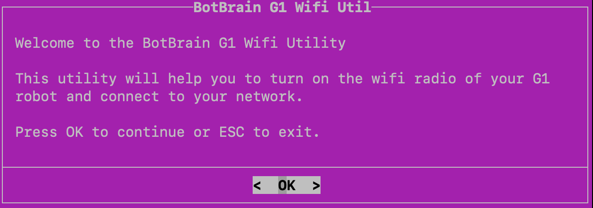
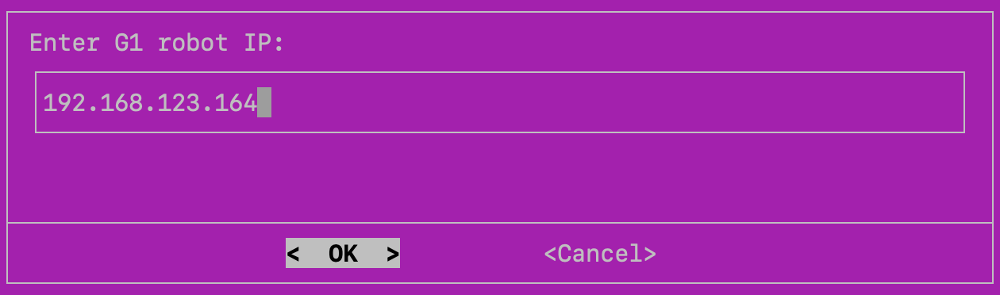
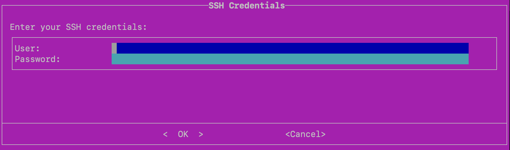
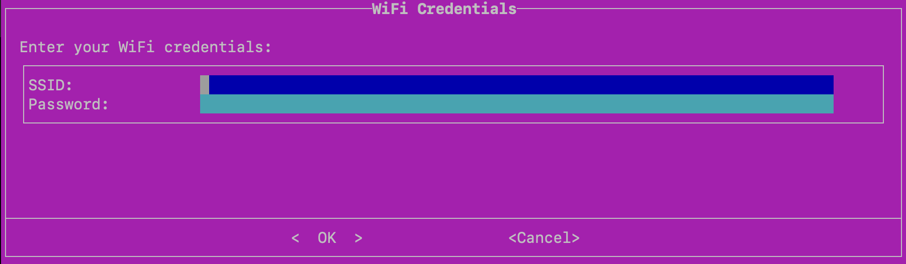
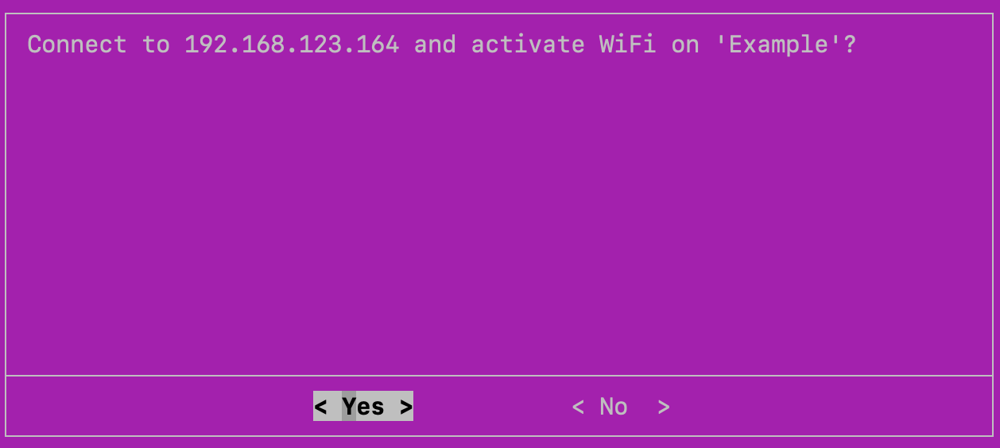
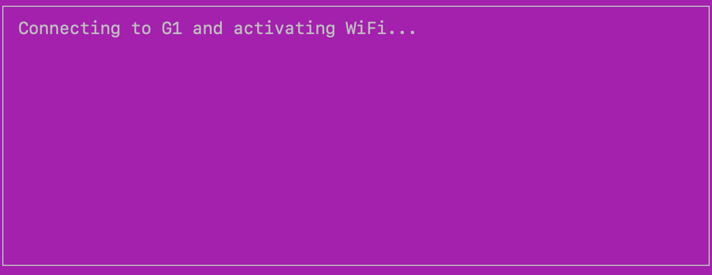
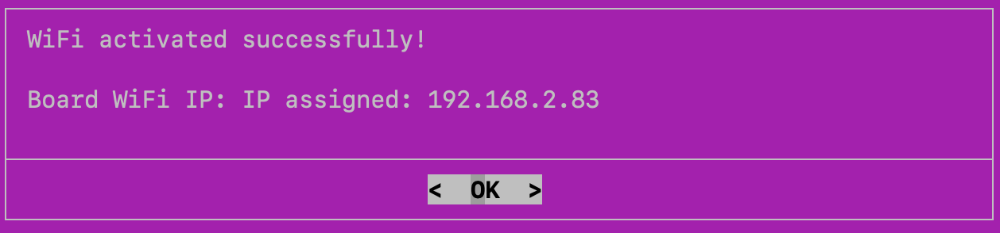

# BotBrain G1 WiFi Utility

A terminal-based utility to remotely enable and configure the WiFi radio on a Unitree G1 robot over SSH.

---

## Table of Contents

- [BotBrain G1 WiFi Utility](#botbrain-g1-wifi-utility)
  - [Table of Contents](#table-of-contents)
  - [Overview](#overview)
  - [Requirements](#requirements)
  - [Usage](#usage)
  - [Step-by-Step Walkthrough](#step-by-step-walkthrough)
    - [1. Welcome Screen](#1-welcome-screen)
    - [2. Robot IP Address](#2-robot-ip-address)
    - [3. SSH Credentials](#3-ssh-credentials)
    - [4. WiFi Credentials](#4-wifi-credentials)
    - [5. Confirmation](#5-confirmation)
    - [6. Execution](#6-execution)
    - [7. Result](#7-result)
  - [Troubleshooting](#troubleshooting)
  - [Next Steps](#next-steps)

---

## Overview

This script provides a guided, interactive interface to:

- Connect to your G1 robot via SSH
- Unblock and enable the onboard WiFi radio
- Scan and connect to a target WiFi network
- Configure route priorities so the robot can access the internet through WiFi

---

## Requirements

The following tools must be available on your machine. The script will attempt to install them automatically if they are missing:

- [`dialog`](https://invisible-island.net/dialog/) — terminal UI library
- [`sshpass`](https://linux.die.net/man/1/sshpass) — non-interactive SSH password authentication

**Supported host operating systems:**

| OS | Package Manager |
|----|----------------|
| Ubuntu / Debian | `apt` |
| Fedora / RHEL / CentOS | `dnf` / `yum` |
| Arch / Manjaro | `pacman` |
| macOS | `brew` |

---

## Usage

```bash
sudo chmod +x g1_wifi_util.sh
./g1_wifi_util.sh
```

---

## Step-by-Step Walkthrough

### 1. Welcome Screen




**What to do:** 

- Press **OK** to start the utility or **ESC** to exit.

---

### 2. Robot IP Address

Enter the IP address of your G1 robot on the local network.




- Default: `192.168.123.164`
- This is the address used to establish the SSH connection

**What to do:** 

- Type the robot's IP address and press **OK**.

---

### 3. SSH Credentials



Enter the SSH credentials for your robot's onboard computer.

| Field | Description |
|-------|-------------|
| User | SSH username (e.g. `unitree`) |
| Password | SSH password for the robot |

> **Note:** The password is also used to run `sudo` commands on the robot.

**What to do:** 

- Fill in both fields and press **OK**.

---

### 4. WiFi Credentials




Enter the WiFi network you want the robot to connect to.

| Field | Description |
|-------|-------------|
| SSID | Name of the target WiFi network (case-sensitive) |
| Password | WiFi network password |

**What to do:** 

- Enter the SSID and password of the target network, then press **OK**.

---

### 5. Confirmation



Review the target host and SSID, then confirm to proceed.

<br>

**What to do:** 

- Verify the displayed information and press **Yes** to continue or **No** to cancel.

---

### 6. Execution



The script will remotely perform the following steps on the robot:

1. Unblock the WiFi radio via `rfkill`
2. Enable the WiFi radio via `nmcli`
3. Scan for the target SSID (up to 15 attempts)
4. Connect to the WiFi network
5. Wait for an IP to be assigned on `wlan0` (up to 15 attempts)
6. Add a default route via the WiFi gateway with a lower metric than Ethernet
7. Persist the route metric and default gateway settings via `nmcli`
8. Return the assigned WiFi IP address

**What to do:** 

- Wait for the process to complete — no input required.

---

### 7. Result




On success, the robot's WiFi IP address is displayed. On failure, the full command output is shown for debugging.

**What to do:** 

- Note the assigned WiFi IP for future use. If an error is shown, refer to the [Troubleshooting](#troubleshooting) section below.

---

## Troubleshooting

**"Network not found after timeout"**
- Make sure the SSID is correct and spelled exactly as it appears
- Ensure the WiFi network is within range of the robot

**"No IP assigned to wlan0 after timeout"**
- The connection may have failed silently — double-check the WiFi password
- Try running `nmcli device wifi list` on the robot manually to verify connectivity

**`sshpass` or `dialog` installation fails**
- Install them manually and re-run the script:
  ```bash
  sudo apt install dialog sshpass   # Ubuntu/Debian
  brew install dialog sshpass       # macOS
  ```

**SSH connection refused**
- Verify the robot IP address is correct
- Ensure the robot is powered on and reachable: `ping 192.168.123.164`

---

## Next Steps

Once the script completes successfully and the G1 is connected to WiFi, the robot's internal Jetson computer is now accessible over the network — which means you're ready to install BotBrain directly on the robot.

Continue with the [README.md](../README.md#3-software-setup) documentation starting from the **Software Setup** section to proceed with installing BotBrain's dependencies and the software itself on the G1's onboard Jetson.
